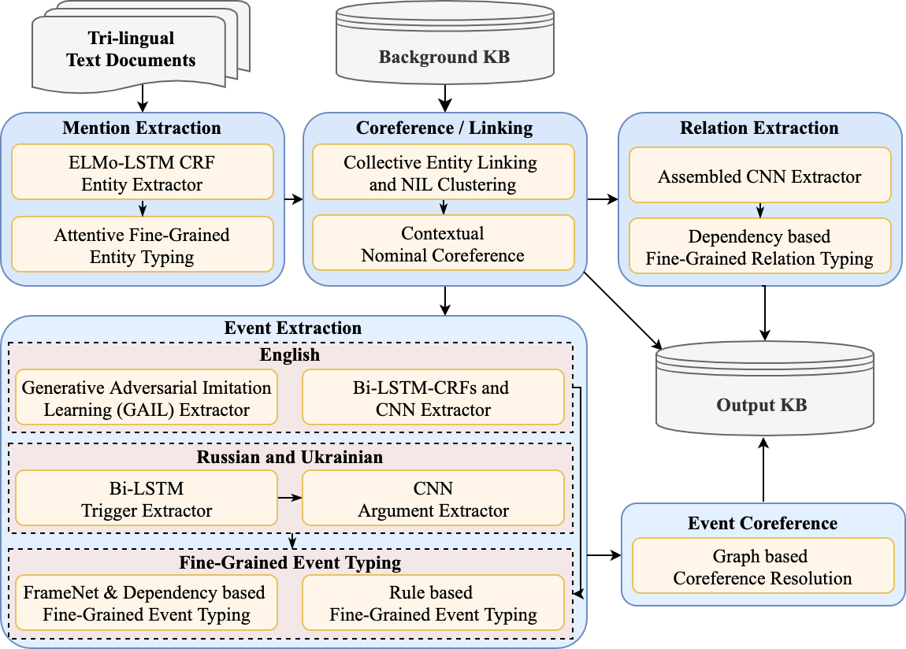

# UIUC Information Extraction Pipeline
One single script to run text information extraction, including fine-grained entity extraction, relation extraction and event extraction.

Table of Contents
=================
  * [Overview](#overview)
  * [Requirements](#requirements)
  * [Quickstart](#quickstart)
  
## Overview
<p align="center">
  
</p>

## Requirements
Docker (Please do not set up UIUC IE Pipeline in a NAS, as the EDL needs MongoDB, which may lead to permission issues in a NAS.)


## Quick Start

### Running LDC corpus, such as `LDC2019E42_AIDA_Phase_1_Evaluation_Source_Data_V1.0`.
```bash
sh pipeline_sample.sh ${data_root_ldc} ${output_dir} ${parent_child_tab} ${en_asr_path} ${en_ocr_path} ${ru_ocr_path}
```
where `parent_child_tab` is the file meta data in `docs` of LDC corpus. For example, 
```bash
sh pipeline_sample.sh ${PWD}/data/testdata_ldc ${PWD}/data/testdata_ldc/output ${PWD}/data/testdata_ldc/docs/parent_children.tab ${PWD}/data/asr.english ${PWD}/data/video.ocr/en.cleaned.csv ${PWD}/data/video.ocr/ru.cleaned.csv
```
If there is no ASR and OCR files, please use `None` as input, e.g.,
```bash
sh pipeline_sample.sh ${PWD}/data/testdata_ldc ${PWD}/data/testdata_ldc/output ${PWD}/data/testdata_ldc/docs/parent_children.tab None None None
```

For OneIE version, please use the script `pipeline_sample_oneie.sh` 
```bash
sh pipeline_sample_oneie.sh ${data_root_ltf} ${data_root_rsd} ${output_dir} ${parent_child_tab} ${en_asr_path} ${en_ocr_path} ${ru_ocr_path}
```
For example, 
```bash
sh pipeline_sample_oneie.sh ${PWD}/data/testdata_all_oneie/ltf ${PWD}/data/testdata_all_oneie/rsd ${PWD}/data/testdata_all_oneie/output ${PWD}/data/testdata_all_oneie/parent_children.sorted.tab ${PWD}/data/asr.english ${PWD}/data/video.ocr/en.cleaned.csv ${PWD}/data/video.ocr/ru.cleaned.csv
```
Note that the file paths are absolute paths.

### Running on raw text data
* Make sure you have RSD (Raw Source Data, ending with `*.rsd.txt`) and LTF (Logical Text Format, ending with `*.ltf.xml`) files. 
	* If you have RSD files, please use the `aida_utilities/rsd2ltf.py` to generate the LTF files. 
	* If you have LTF files, please use the AIDA ltf2rsd tool (`LDC2018E62_AIDA_Month_9_Pilot_Eval_Corpus_V1.0/tools/ltf2txt/ltf2rsd.perl`) to generate the RSD files. 
* Edit the `pipeline_sample.sh` for your run, including `data_root` containing a subfolder `ltf` with your input LTF files and a subfolder `rsd` with your input RSD files. Then run the shell file, 
```bash
sh pipeline_sample_full.sh ${data_root_ltf} ${data_root_rsd} ${output_dir} ${parent_child_tab} ${en_asr_path} ${en_ocr_path} ${ru_ocr_path}
```
For example, 
```bash
sh pipeline_sample_full.sh ${PWD}/data/testdata_all/ltf ${PWD}/data/testdata_all/rsd ${PWD}/data/output ${PWD}/data/testdata_all/parent_children.sorted.tab ${PWD}/data/asr.english ${PWD}/data/video.ocr/en.cleaned.csv ${PWD}/data/video.ocr/ru.cleaned.csv
```
